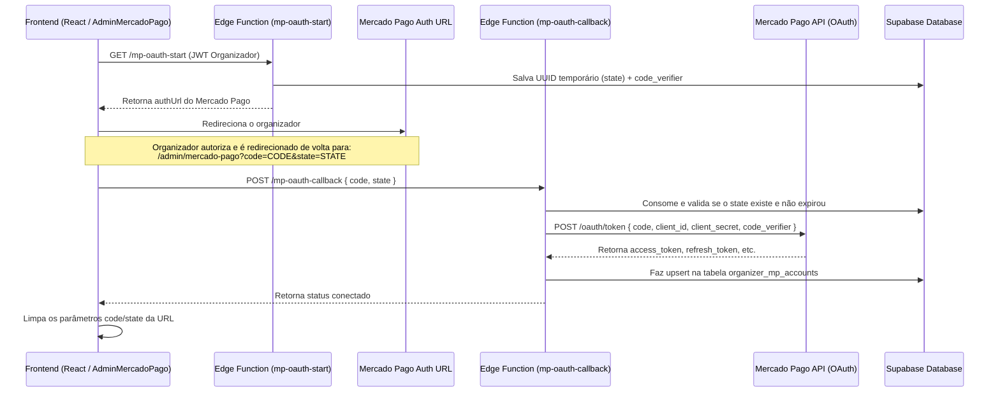

# Especificação de Integração de Pagamento - Mercado Pago OAuth

Esta especificação descreve a arquitetura, o fluxo de dados, a modelagem de banco de dados e os prompts de IA recomendados para recriar a integração de split de pagamento/marketplace baseada em OAuth com o Mercado Pago implementada no projeto.

---

## 1. Visão Geral da Arquitetura

A integração adota o modelo de **Split de Pagamentos (Marketplace)** do Mercado Pago via **OAuth (Authorization Code com PKCE opcional)**. Isso permite que múltiplos organizadores conectem suas contas individuais do Mercado Pago à plataforma para receber os pagamentos das vendas de ingressos diretamente, com a plataforma retendo uma taxa de serviço (ex.: 10%) sobre a transação.

A arquitetura de segurança é baseada no princípio de **Zero Trust Client**: o frontend nunca armazena, gerencia ou tem acesso direto aos tokens do Mercado Pago (`access_token` ou `refresh_token`). Toda a manipulação de tokens e chamadas para a API do Mercado Pago são realizadas no backend seguro pelas Supabase Edge Functions usando a `service_role`.



---

## 2. Modelagem do Banco de Dados (SQL)

As tabelas no Supabase são isoladas via **Row Level Security (RLS)** sem nenhuma política de acesso público ou autenticado padrão. Apenas a `service_role` (usada pelas Edge Functions) tem permissão de leitura/escrita.

```sql
-- 1. Tabela para armazenar as credenciais OAuth vinculadas ao Organizador
CREATE TABLE IF NOT EXISTS public.organizer_mp_accounts (
    id uuid DEFAULT gen_random_uuid() PRIMARY KEY,
    organizer_id uuid NOT NULL UNIQUE REFERENCES auth.users(id) ON DELETE CASCADE,
    mp_user_id text,
    access_token text,
    refresh_token text,
    public_key text,
    scopes text,
    token_expires_at timestamptz,
    status text NOT NULL DEFAULT 'disconnected' 
        CHECK (status IN ('connected', 'disconnected', 'expired')),
    connected_at timestamptz,
    created_at timestamptz NOT NULL DEFAULT now(),
    updated_at timestamptz NOT NULL DEFAULT now()
);

-- RLS ativada para garantir que o cliente/frontend não tenha acesso direto aos tokens
ALTER TABLE public.organizer_mp_accounts ENABLE ROW LEVEL SECURITY;

-- 2. Tabela para gerenciar os estados de segurança (CSRF) e PKCE temporários (uso único)
CREATE TABLE IF NOT EXISTS public.mp_oauth_states (
    state text PRIMARY KEY,
    organizer_id uuid NOT NULL REFERENCES auth.users(id) ON DELETE CASCADE,
    code_verifier text, -- Armazena o verifier se o PKCE estiver ativo
    created_at timestamptz NOT NULL DEFAULT now(),
    expires_at timestamptz NOT NULL DEFAULT (now() + interval '10 minutes')
);

ALTER TABLE public.mp_oauth_states ENABLE ROW LEVEL SECURITY;
```

---

## 3. Fluxo detalhado das Edge Functions

### A. `mp-oauth-start`
1. **Autenticação:** Valida o JWT enviado no header `Authorization`.
2. **Autorização:** Valida se o usuário autenticado possui role de `organizer` ou `admin`.
3. **Segurança:** Gera um `state` (UUID aleatório) contra CSRF. Se a env var `MP_USE_PKCE` for `true`, gera um `code_verifier` aleatório e calcula o `code_challenge` via SHA-256 codificado em Base64URL.
4. **Persistência:** Salva `state`, `organizer_id` e `code_verifier` na tabela `mp_oauth_states`.
5. **Retorno:** Retorna a URL de autorização montada com a URI de redirecionamento, `client_id`, `state` e os parâmetros de PKCE (se aplicável).

### B. `mp-oauth-callback`
1. **Validação:** Recebe `{ code, state }` via JSON.
2. **Consumo de Estado:** Busca o registro correspondente ao `state` em `mp_oauth_states`. Se válido e não expirado, consome (deleta) o registro.
3. **Troca de Token:** Efetua uma requisição POST segura para `https://api.mercadopago.com/oauth/token` com `grant_type: "authorization_code"`, incluindo as credenciais secretas do aplicativo e o `code_verifier` (se armazenado no state para PKCE).
4. **Persistência:** Realiza o `upsert` das credenciais do organizador na tabela `organizer_mp_accounts` definindo `status = 'connected'`.
5. **Retorno:** Retorna status de sucesso para o frontend.

### C. Helper de Renovação de Tokens (`_shared/mp-tokens.ts`)
Para evitar falhas em requisições de pagamento futuras devido à expiração do `access_token` (geralmente válido por 180 dias no Mercado Pago):
- A função helper `getOrganizerToken(supabase, organizerId)` é executada sempre que um pagamento precisa ser iniciado ou consultado.
- Verifica se a data atual ultrapassou o `token_expires_at` (aplicando um "skew" de segurança de 60 segundos).
- Caso o token esteja expirado ou perto de expirar, a função faz uma requisição HTTP POST para `https://api.mercadopago.com/oauth/token` enviando o `refresh_token` e o `grant_type: "refresh_token"`.
- O banco é atualizado com o novo `access_token`, novo `refresh_token` e a nova data de expiração antes de entregar o token válido à função solicitante.

---

## 4. Fluxo Frontend (Página Administrativa)

A página `AdminMercadoPago.tsx` gerencia a interface administrativa do organizador:
1. **Checagem Inicial:** Chama a função `mp-account-status` para ler se há conexão ativa e exibir o status (Conectado / Desconectado).
2. **Fluxo de Conexão:** Ao clicar em "Conectar", chama a Edge Function `mp-oauth-start`, obtém a `authUrl` do Mercado Pago e redireciona o usuário (`window.location.href = authUrl`).
3. **Tratamento de Retorno:** Um `useEffect` observa os parâmetros `code` e `state` na URL. Se presentes, chama a Edge Function `mp-oauth-callback` no backend, exibe toast de sucesso, atualiza o status de exibição da tela e remove os parâmetros da barra de endereços usando o `useSearchParams` do React Router para manter a URL limpa.

---

## 5. Prompt de IA Mestre para recriar a Integração

Abaixo está o prompt que pode ser copiado e enviado para qualquer IA geradora de código a fim de implementar essa exata solução em uma infraestrutura React (Vite) + Supabase:

```text
Você é um desenvolvedor especialista em Supabase, React e integrações de pagamentos. Preciso implementar uma integração de split de pagamento/marketplace de ingressos com o Mercado Pago via OAuth (Authorization Code) no nosso sistema. 

A arquitetura deve seguir as seguintes diretrizes rígidas de segurança e separação de responsabilidades:

1. SEGURANÇA (Zero Trust Client):
- O frontend nunca deve manusear tokens sensíveis (access_token, refresh_token, client_secret).
- Todas as chamadas para a API do Mercado Pago e armazenamento de credenciais devem ser gerenciadas por Supabase Edge Functions usando a service_role e RLS estrito (sem acesso direto de leitura/escrita para authenticated ou anon nas tabelas de tokens).

2. MODELO DE BANCO DE DADOS (Desejo o script SQL para migração):
- Crie uma tabela `public.organizer_mp_accounts` ligada a `auth.users(id)` com chave única por organizador. Deve armazenar `mp_user_id`, `access_token`, `refresh_token`, `public_key`, `scopes`, `token_expires_at` e `status` ('connected', 'disconnected', 'expired').
- Crie uma tabela `public.mp_oauth_states` para proteção contra CSRF. Deve armazenar o `state` (UUID chave primária), o `organizer_id` dono do fluxo, um campo `code_verifier` (texto, nulo por padrão para suporte opcional a PKCE) e `expires_at` (padrão de 10 minutos a partir do insert).
- Habilite RLS em ambas as tabelas sem políticas públicas/autenticadas para que apenas a service-role possa acessá-las.

3. EDGE FUNCTIONS DO SUPABASE (Deno / TypeScript):
- Desenvolva a função `mp-oauth-start` que:
  a. Autentica o usuário pelo JWT do Supabase recebido no header Authorization.
  b. Confirma que o usuário possui permissão adequada.
  c. Gera um UUID aleatório para `state`. Se PKCE estiver configurado por variável de ambiente (`MP_USE_PKCE=true`), gera um `code_verifier` aleatório e calcula o `code_challenge` SHA-256 Base64URL.
  d. Insere o estado gerado no banco de dados.
  e. Constrói e retorna a URL de consentimento oficial do Mercado Pago (`https://auth.mercadopago.com.br/authorization`) contendo client_id, response_type=code, redirect_uri e state (além de code_challenge/method se PKCE ativo).
  
- Desenvolva a função `mp-oauth-callback` que:
  a. Recebe `{ code, state }` via requisição HTTP POST vinda do frontend.
  b. Valida o `state` no banco de dados. Se válido e não expirado, consome (deleta) o registro para evitar reuso.
  c. Envia uma chamada HTTP POST para a API do Mercado Pago (`https://api.mercadopago.com/oauth/token`) com o `code`, `client_id`, `client_secret` do app e o `code_verifier` recuperado (caso o fluxo tenha iniciado com PKCE).
  d. Faz o upsert dos tokens de acesso e refresh retornados na tabela `organizer_mp_accounts` associando-os ao organizador correto.

- Desenvolva uma biblioteca utilitária compartilhada (`_shared/mp-tokens.ts`) contendo a função `getOrganizerToken(supabase, organizerId)` que:
  a. Recupera os tokens do organizador no banco de dados.
  b. Verifica se o `access_token` expirou ou está perto de expirar (dentro de uma janela de 60 segundos).
  c. Caso esteja expirado, efetua automaticamente a renovação do token na API do Mercado Pago usando o `refresh_token` e o `grant_type: "refresh_token"`.
  d. Salva os novos tokens no banco de dados e retorna o token de acesso ativo e pronto para uso.

4. FRONTEND (Vite / React / TypeScript / Tailwind CSS / Shadcn/ui):
- Crie uma página administrativa `/admin/mercado-pago` que exibe se a conta do organizador está conectada (chamando a Edge Function correspondente para carregar o status).
- Exiba um botão "Conectar Mercado Pago" caso não haja conexão. Este botão dispara a chamada para a Edge Function `mp-oauth-start` e redireciona o usuário para a URL de autorização retornada.
- No carregamento da página (via hook / useEffect), capture os parâmetros `code` e `state` presentes na URL de callback, envie-os no payload de uma requisição para a Edge Function `mp-oauth-callback`. Ao obter sucesso, limpe esses parâmetros da URL utilizando o roteador do React, apresente um toast de sucesso e atualize o estado de exibição para "Conectado".
```
