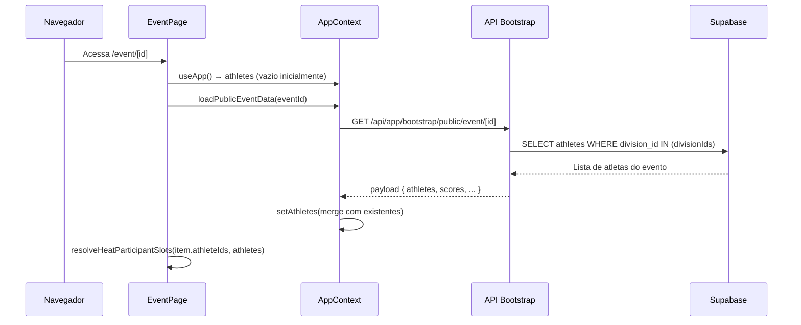
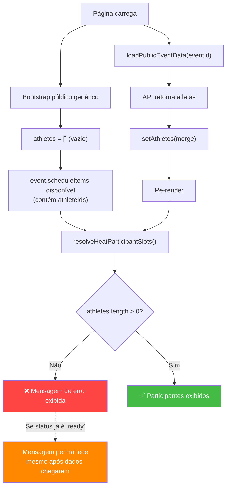

# Análise do Erro: "Participantes vinculados, mas os perfis públicos ainda não foram encontrados"

## 1. Descrição Detalhada do Erro

Na página pública do evento ([page.tsx](file:///Users/luanvilaar/Desktop/Projetos/wodarena/src/app/event/%5Bid%5D/page.tsx#L610-L615)), na aba **Cronograma**, quando um item do cronograma é do tipo `heat` (bateria), o sistema tenta exibir os atletas alocados naquela bateria. Ao invés de mostrar os nomes dos participantes, exibe a mensagem:

> **"Participantes vinculados, mas os perfis públicos ainda não foram encontrados."**

Isso significa que:
- A bateria **possui** `athleteIds` preenchidos (IDs de atletas foram salvos no cronograma pelo admin).
- Porém, ao tentar resolver esses IDs contra a lista de atletas carregada no contexto (`athletes`), **nenhum** match foi encontrado.
- O resultado: `totalCount > 0` mas `resolvedParticipants.length === 0`.

---

## 2. Explicação Técnica — Causa Raiz

### Fluxo de Dados Envolvido



### A Raiz do Problema

O problema tem **duas causas possíveis**, potencialmente ocorrendo simultaneamente:

---

### Causa 1: Race Condition — Timing de Renderização vs Carregamento

| Componente | Arquivo |
|---|---|
| Resolução dos participantes | [scheduleParticipants.ts](file:///Users/luanvilaar/Desktop/Projetos/wodarena/src/lib/scheduleParticipants.ts#L40-L66) |
| Chamada de resolução na página | [page.tsx:L536](file:///Users/luanvilaar/Desktop/Projetos/wodarena/src/app/event/%5Bid%5D/page.tsx#L536) |
| Carregamento dos atletas públicos | [AppContext.tsx:L407-L471](file:///Users/luanvilaar/Desktop/Projetos/wodarena/src/context/AppContext.tsx#L407-L471) |

**O que acontece:**

1. O **bootstrap público genérico** ([buildPublicBootstrapPayload](file:///Users/luanvilaar/Desktop/Projetos/wodarena/src/lib/bootstrapPayload.ts#L142-L181)) retorna `athletes: []` — ele **não carrega atletas**.
2. Os atletas só são carregados pelo **bootstrap específico do evento** ([buildPublicEventBootstrapPayload](file:///Users/luanvilaar/Desktop/Projetos/wodarena/src/lib/bootstrapPayload.ts#L183-L241)), que é chamado via `loadPublicEventData`.
3. O `event.scheduleItems` (que contém os `athleteIds`) já está disponível **antes** dos atletas serem carregados — ele vem inline no campo JSONB `event_schedule` do evento.
4. A função [resolveHeatParticipantSlots](file:///Users/luanvilaar/Desktop/Projetos/wodarena/src/lib/scheduleParticipants.ts#L40-L66) é executada **a cada render**, usando `athletes` do contexto. No primeiro render, ou enquanto o status é `loading`, `athletes` ainda está vazio ou incompleto.

**Resultado:** A página renderiza antes dos atletas estarem disponíveis. O `isPublicEventLoading` deveria proteger isso (linha [L612](file:///Users/luanvilaar/Desktop/Projetos/wodarena/src/app/event/%5Bid%5D/page.tsx#L612)), mas a condição para mostrar "em carregamento..." depende de `publicEventDataStatus[eventId] === 'loading'`. Se o status já transicionou para `'ready'` mas o React ainda não re-renderizou com os novos atletas, a mensagem de fallback aparece.

> [!IMPORTANT]
> Há uma janela de tempo entre o `setPublicEventDataStatus('ready')` (linha [460](file:///Users/luanvilaar/Desktop/Projetos/wodarena/src/context/AppContext.tsx#L460)) e o `setAthletes(merge)` (linha [447](file:///Users/luanvilaar/Desktop/Projetos/wodarena/src/context/AppContext.tsx#L447)). O React pode batchear esses `setState` de forma inconsistente em cenários assíncronos, fazendo com que o status seja `ready` antes dos atletas estarem no estado.

---

### Causa 2: Cache Impedindo Recarga — `loadedPublicEventIdsRef`

| Componente | Arquivo |
|---|---|
| Guard de cache | [AppContext.tsx:L413](file:///Users/luanvilaar/Desktop/Projetos/wodarena/src/context/AppContext.tsx#L413) |
| Set do cache | [AppContext.tsx:L459](file:///Users/luanvilaar/Desktop/Projetos/wodarena/src/context/AppContext.tsx#L459) |

**O que acontece:**

A função `loadPublicEventData` marca o evento como carregado em um `useRef` (Set):

```typescript
if (loadedPublicEventIdsRef.current.has(eventId)) return; // L413
// ...
loadedPublicEventIdsRef.current.add(eventId); // L459
```

Se a primeira tentativa de carregamento **foi bem-sucedida** (status `ready`), mas os atletas retornados pelo banco foram **zero** (ex: divisões foram criadas mas atletas ainda não foram cadastrados), o sistema **nunca tentará recarregar**, mesmo que atletas tenham sido adicionados posteriormente. A página permanecerá mostrando a mensagem de erro.

---

### Causa 3: IDs Inconsistentes entre Schedule e Atletas

| Componente | Arquivo |
|---|---|
| Alocação de IDs no admin | [admin/page.tsx:L5044-L5058](file:///Users/luanvilaar/Desktop/Projetos/wodarena/src/app/admin/page.tsx#L5044-L5058) |
| Resolução por Map | [scheduleParticipants.ts:L45-L50](file:///Users/luanvilaar/Desktop/Projetos/wodarena/src/lib/scheduleParticipants.ts#L45-L50) |

**O que acontece:**

Os `athleteIds` salvos no `event_schedule` (JSONB) vêm do admin, onde são selecionados da lista de atletas com IDs do formato `athlete.id`. A resolução usa um `Map<string, Athlete>` indexado por `athlete.id`.

**Cenário de inconsistência:**
- Se um atleta foi **excluído e recriado** (novo ID) após a alocação da bateria, o ID no schedule ficará orphan.
- Se o atleta foi **movido para outra divisão** de outro evento, ele não retornará na query do bootstrap público (que filtra por `division_id IN (divisionIds)` do evento).
- Se os `athleteIds` contêm strings vazias (`""`) da inicialização com `Array.from({ length: capacity }, (_, idx) => currentAlloc[idx] || "")`, a função `getFilledHeatParticipantSlots` filtra essas (`.filter(slot => Boolean(slot.athleteId))`), então strings vazias não causam o problema.

---

## 3. Possíveis Soluções

### Solução A: Corrigir a Ordem dos `setState` no `loadPublicEventData`

**Descrição:** Mover o `setPublicEventDataStatus('ready')` para **depois** do `setAthletes`, garantindo que o status só mude após os atletas estarem no estado.

**Arquivos impactados:**
- [AppContext.tsx:L447-L460](file:///Users/luanvilaar/Desktop/Projetos/wodarena/src/context/AppContext.tsx#L447-L460)

**Alteração:**
```diff
  setAthletes(previous => [...]);
  setScores(previous => [...]);
  setLeaderboardEntries(previous => [...]);
  loadedPublicEventIdsRef.current.add(eventId);
+ setPublicEventDataStatus(previous => ({ ...previous, [eventId]: 'ready' }));
- setPublicEventDataStatus(previous => ({ ...previous, [eventId]: 'ready' }));
```

> [!NOTE]
> No React 18+, múltiplos `setState` dentro de uma mesma microtask assíncrona são **automaticamente agrupados** (automatic batching). Isso significa que na maioria dos casos essa reordenação já é irrelevante. Porém, garantir a ordem lógica é uma boa prática defensiva.

---

### Solução B: Invalidar o Cache `loadedPublicEventIdsRef` Quando Atletas Estão Vazios

**Descrição:** Não marcar o evento como carregado no cache se os atletas retornados forem zero, permitindo uma recarga futura.

**Arquivos impactados:**
- [AppContext.tsx:L459](file:///Users/luanvilaar/Desktop/Projetos/wodarena/src/context/AppContext.tsx#L459)

**Alteração conceitual:**
```diff
- loadedPublicEventIdsRef.current.add(eventId);
+ if (mappedAthletes.length > 0) {
+   loadedPublicEventIdsRef.current.add(eventId);
+ }
```

---

### Solução C: Tratar o Fallback de UI com Lógica Mais Robusta

**Descrição:** Alterar a condição de exibição da mensagem na página do evento para considerar **tanto** o status de loading **quanto** se os atletas já foram efetivamente carregados no contexto.

**Arquivos impactados:**
- [page.tsx:L610-L614](file:///Users/luanvilaar/Desktop/Projetos/wodarena/src/app/event/%5Bid%5D/page.tsx#L610-L614)

**Alteração conceitual:**
```diff
- {isPublicEventLoading
-   ? 'Participantes em carregamento...'
-   : 'Participantes vinculados, mas os perfis públicos ainda não foram encontrados.'}
+ {isPublicEventLoading || athletes.length === 0
+   ? 'Participantes em carregamento...'
+   : 'Participantes vinculados, mas os perfis públicos ainda não foram encontrados.'}
```

---

### Solução D: Abordagem Combinada (A + B + C)

**Descrição:** Aplicar as três soluções juntas para cobrir todos os cenários:
1. Garantir ordem lógica dos `setState` (defensivo).
2. Não cachear eventos que retornaram sem atletas.
3. Melhorar o fallback de UI para não exibir mensagem de erro prematuramente.

---

## 4. Riscos e Impactos de Cada Solução

| Solução | Risco | Impacto | Complexidade |
|---------|-------|---------|-------------|
| **A** (Reordenar setState) | Baixo — React 18+ já faz batching automático, então o efeito pode ser mínimo. | Melhoria defensiva na consistência de estado. | 🟢 Trivial |
| **B** (Invalidar cache) | Médio — Pode causar chamadas API repetidas se um evento realmente não tem atletas (ex: evento sem inscrições). | Resolve o cenário de dados carregados tardiamente. Pode gerar mais requests ao backend. | 🟡 Baixa |
| **C** (Melhorar fallback UI) | Baixo — Verifica `athletes.length === 0` pode gerar falso positivo se existem atletas de *outros* eventos no contexto. | Melhoria imediata na UX, evitando mensagem alarmante. | 🟡 Baixa |
| **D** (Combinada) | Baixo — Cobertura máxima de cenários. | Resolve a race condition, o cache prematuro e a mensagem de UX confusa. | 🟡 Moderada |

> [!WARNING]
> A **Solução B** isolada pode gerar loops de requisições se o evento genuinamente não possui atletas cadastrados. É necessário adicionar um controle de retry (ex: máximo de 2 tentativas) ou usar um TTL no cache.

---

## 5. Recomendação

> [!IMPORTANT]
> **Recomendo a Solução D (combinada)**, com os seguintes ajustes:

### Prioridade de Implementação

1. **Solução C (UI)** — Efeito imediato na experiência do usuário. A condição deve verificar se o `publicEventDataStatus` é `'ready'` **E** se existem atletas carregados com `divisionId` pertencente ao evento atual, não apenas `athletes.length`.

2. **Solução A (Ordem dos setState)** — Boa prática defensiva, sem risco. Mover o `setPublicEventDataStatus('ready')` para ser o **último** setState no bloco de sucesso.

3. **Solução B (Cache inteligente)** — Com limitação de retry (máximo 2 tentativas por sessão) para evitar loops. Usar um `Map<string, number>` ao invés de `Set<string>` para contar tentativas.

### Por Que Essa Abordagem?

- **Causa raiz principal:** A race condition entre dados do evento (que incluem `scheduleItems` com `athleteIds`) e os atletas (que são carregados assincronamente) é uma **condição de design**, não um bug isolado.
- **A UI deve ser resiliente** ao estado parcial — mostrando "carregando" até que os dados necessários estejam de fato disponíveis.
- **O cache deve ser inteligente** — não se comprometendo prematuramente quando os dados carregados são insuficientes.

### Verificação Sugerida

- Testar com um evento que tenha baterias publicadas com atletas alocados.
- Verificar no DevTools que o status `publicEventDataStatus` transiciona corretamente.
- Confirmar que ao recarregar a página, os participantes aparecem corretamente após o carregamento.
- Testar com rede lenta (throttle) para simular a race condition.

---

## Resumo Visual do Fluxo do Problema


