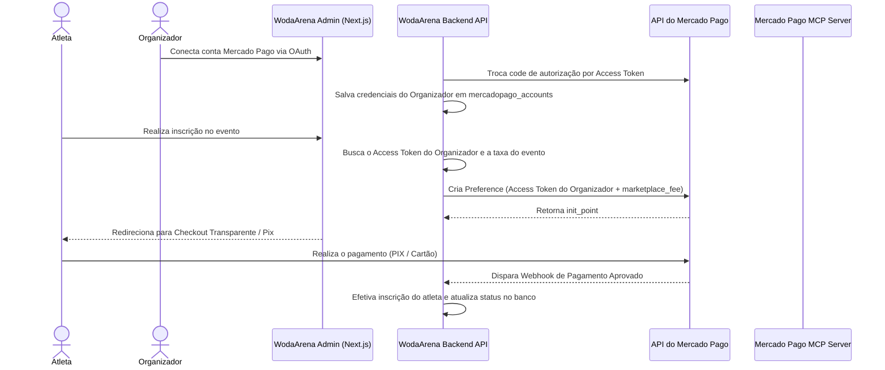

# Plano de Integração: Mercado Pago Marketplace & Split de Pagamentos

Este plano descreve o design técnico e o roteiro de integração para habilitar pagamentos de inscrições diretamente nas contas dos organizadores dos eventos, retendo automaticamente uma taxa de comissão da plataforma WodArena via split de pagamentos (parâmetro `marketplace_fee`). 

Para agilizar o desenvolvimento, testes e homologação, faremos uso das ferramentas fornecidas pelo **Mercado Pago MCP Server**.

---

## 🏛️ Arquitetura do Fluxo de Split (Marketplace)



---

## 🛠️ Utilização do Mercado Pago MCP Server nos Testes

O **Mercado Pago MCP Server** será a ferramenta central para emular o ecossistema de marketplace localmente e testar o split sem necessidade de cartões ou contas de produção reais. As seguintes ações serão executadas via ferramentas MCP:

1. **Geração de Contas de Teste (Sandbox):**
   - Criação de uma conta de teste tipo **Vendedor (Organizador do Evento)** para obter credenciais simuladas e simular o fluxo OAuth.
   - Criação de uma conta de teste tipo **Comprador (Atleta)** com saldo fictício configurado para pagar as preferências.
2. **Pesquisa da Documentação:**
   - Uso de tools de busca de documentação do MCP para verificar o formato exato da chamada de split (`marketplace_fee`) e parâmetros de estorno proporcionais.
3. **Simulação e Depuração de Webhooks:**
   - Registro de webhooks locais e monitoramento dos payloads enviados pelo Mercado Pago usando ferramentas do servidor MCP.

---

## 🗄️ Estrutura de Banco de Dados (Supabase)

Para persistir a conexão OAuth e calcular o split, utilizaremos as seguintes tabelas e colunas:

### 1. Tabela `mercadopago_accounts` [EXISTENTE]
Armazena as chaves OAuth dos organizadores do evento:
* `user_id` (UUID, chave estrangeira para a tabela de perfis de usuário, única)
* `access_token` (Text, token para criar preferências em nome do organizador)
* `refresh_token` (Text, token para renovação periódica)
* `public_key` (Text)
* `status` (Text, ex: `'connected'`, `'disconnected'`)
* `expires_at` (Timestamp)

### 2. Coluna na Tabela `events` [EXISTENTE]
* `marketplace_fee` (Numeric, define a taxa fixa em reais cobrada pela plataforma WodArena por cada inscrição. Se nulo, adota a taxa padrão do `.env`).

---

## 💻 Roteiro de Implementação das APIs

### 1. Rota de Criação de Preferência (`/api/checkout/preference/route.ts`)
* **Fluxo:**
  1. Carrega os dados da inscrição (ID do evento e valor total).
  2. Consulta o proprietário (`organizer_id`) do evento no banco Supabase.
  3. Recupera o `access_token` ativo da tabela `mercadopago_accounts` vinculado a esse organizador.
  4. Obtém o valor de `marketplace_fee` definido nas configurações do evento (ou o padrão global).
  5. Monta o payload de requisição do Mercado Pago adicionando a propriedade:
     ```json
     {
       "items": [...],
       "payer": {...},
       "marketplace_fee": 10.00,
       "notification_url": "https://wodarena.com/api/webhooks/mercadopago?event_id=..."
     }
     ```
  6. Dispara o POST para `https://api.mercadopago.com/checkout/preferences` enviando no header `Authorization: Bearer <ACCESS_TOKEN_DO_ORGANIZADOR>`.
  7. Retorna o `init_point` ao frontend.

### 2. Rota de Webhook (`/api/webhooks/mercadopago/route.ts`)
* **Fluxo:**
  1. Recebe a notificação de pagamento do Mercado Pago contendo o `id` da transação.
  2. Identifica o evento associado para buscar o `access_token` correspondente ao organizador dono daquele evento.
  3. Realiza a consulta do status de pagamento em `/v1/payments/${paymentId}` utilizando as credenciais específicas da conta que recebeu o pagamento.
  4. Em caso de status `'approved'`, confirma e registra a inscrição do atleta no Supabase.

---

## 👑 Atualização do Dashboard do Owner (Painel Root)

Para que o proprietário da plataforma WodArena possa auditar e acompanhar o faturamento sob a arquitetura de split de pagamentos, o painel do proprietário (`src/app/owner/page.tsx`) foi atualizado com as seguintes lógicas dinâmicas:

1. **Cálculo Dinâmico de Faturamento da Plataforma:**
   - A estatística consolidada de receita (`stats.platformRevenue`) e o faturamento retido por gestor (`platformFee`) deixam de assumir uma taxa fixa de 10% do volume bruto.
   - O sistema agora mapeia cada inscrição aprovada para o seu evento correspondente e adiciona o valor real configurado no campo `marketplace_fee` (adotando R$ 10,00 como valor padrão caso não esteja definido).
2. **Repasse Líquido Exato:**
   - O repasse líquido do gestor (`netRevenue`) agora é calculado deduzindo exatamente a soma das taxas fixas cobradas pela plataforma (`grossRevenue - platformFee`).
3. **Visibilidade de Taxa por Evento:**
   - Adicionada uma coluna "Taxa Split" na visualização de eventos ativos da plataforma para que o owner visualize instantaneamente a comissão cadastrada em cada evento.
4. **Alinhamento do Modelo Comercial:**
   - Documentação interna do painel atualizada para o modelo de Marketplace Split (divisão imediata via gateway, autonomia de contas e valores em reais).

---

## 🔍 Plano de Verificação e Homologação

### 1. Testes via MCP Server (Sandbox)
* **Passo 1:** Criar um usuário Vendedor de teste através do MCP Server e salvar as credenciais dele localmente.
* **Passo 2:** Iniciar uma inscrição simulando um evento de teste do organizador configurado com a comissão (`marketplace_fee = 15.00`).
* **Passo 3:** Obter o `init_point` da preferência, acessar o link e efetuar o pagamento usando os dados e saldo da conta de Comprador de teste criada no MCP Server.
* **Passo 4:** Verificar no painel de desenvolvedor ou via ferramenta MCP se o pagamento foi dividido corretamente:
  - Valor total descontado do Comprador.
  - Valor (Total - 15.00) creditado na conta do Vendedor de teste.
  - Taxa (15.00) creditada na conta da aplicação principal (WodArena).

### 2. Qualidade e Build
* Rodar `npm run typecheck` para validação de contratos e interfaces TypeScript.
* Rodar `npm test` para assegurar que nenhuma lógica de campeonato foi quebrada.
* Rodar `npm run build` para testar o empacotamento completo.